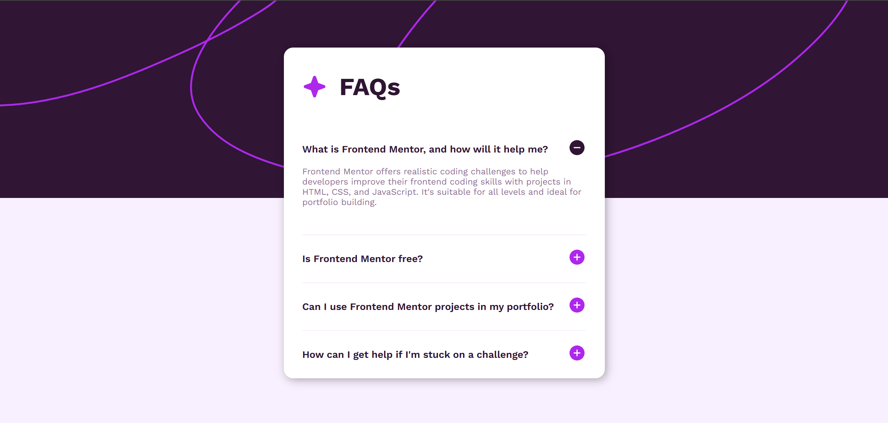

# Responsive Web Project



This is a fully responsive web project built using **HTML, CSS, and JavaScript**. It adapts seamlessly across different screen sizes, providing a smooth user experience on all devices.

## Features

- **Fully Responsive** – Works on desktops, tablets, and mobile devices.  
- **Modern UI** – Clean and attractive design.  
- **Interactive Elements** – Includes JavaScript functionalities for better user experience.  
- **Optimized Performance** – Fast loading and smooth animations.  

## Technologies Used

- **HTML** – Structure of the website  
- **CSS** – Styling and layout (Flex, Media Queries)  
- **JavaScript** – Interactivity and dynamic content  

## How to Use

1. Clone the repository:
   ```bash
   git clone https://github.com/Amine4jh/FAQs-Card.git
   ```
