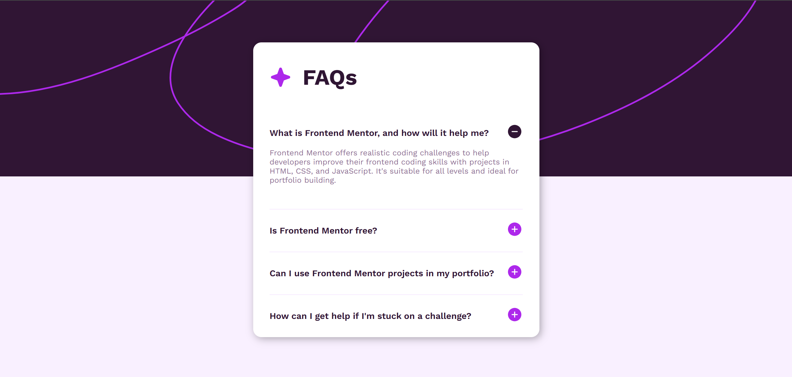

# Responsive Web Project



A fully responsive web project built with **HTML**, **CSS**, and **JavaScript**, designed to deliver a seamless experience across all screen sizes. The layout dynamically adjusts to different devices, while smooth animations enhance user interaction and engagement. This project demonstrates a strong focus on responsive design principles, performance, and clean UI implementation.

## Features

- **Fully Responsive** – Works on desktops, tablets, and mobile devices.  
- **Modern UI** – Clean and attractive design.  
- **Interactive Elements** – Includes JavaScript functionalities for better user experience.  
- **Optimized Performance** – Fast loading and smooth animations.  

## Technologies Used

- **HTML** – Structure of the website  
- **CSS** – Styling and layout (Flex, Media Queries)  
- **JavaScript** – Interactivity and dynamic content  

## How to Use

1. Clone the repository:
   ```bash
   git clone https://github.com/Amine4jh/FAQs-Card.git
   ```

2. Open `index.html` on your browser.